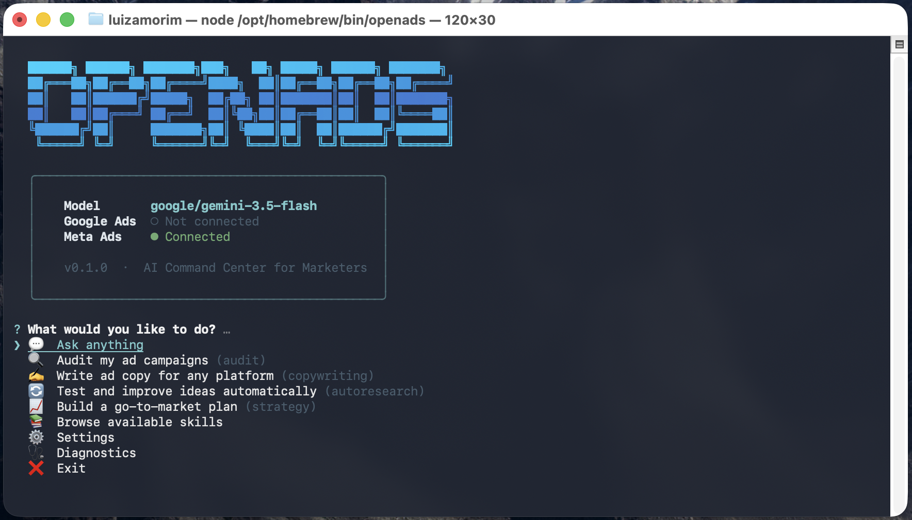

# OpenAds 🎯

```
  ██████╗ ██████╗ ███████╗███╗   ██╗ █████╗ ██████╗ ███████╗
  ██╔═══██╗██╔══██╗██╔════╝████╗  ██║██╔══██╗██╔══██╗██╔════╝
  ██║   ██║██████╔╝█████╗  ██╔██╗ ██║███████║██║  ██║███████╗
  ██║   ██║██╔═══╝ ██╔══╝  ██║╚██╗██║██╔══██║██║  ██║╚════██║
  ╚██████╔╝██║     ███████╗██║ ╚████║██║  ██║██████╔╝███████║
   ╚═════╝ ╚═╝     ╚══════╝╚═╝  ╚═══╝╚═╝  ╚═╝╚═════╝ ╚══════╝

  AI Command Center for Marketers
```

> **Talk to your ad campaigns in plain English.** Connect your Google Ads and Meta accounts, pick your favorite AI model, and let OpenAds handle the analysis while you focus on strategy.

<p align="center">
  
  
  
</p>

---

## What is OpenAds?

OpenAds is an **open-source CLI tool** that turns any AI model into a marketing assistant. It's built for performance marketers, media buyers, and growth leads who want to audit campaigns, write ad copy, and build strategies — all from one place.

**No code. No prompt engineering. No spreadsheet exports.**

### Why use it?

| Feature | What it means for you |
|---|---|
| 🧠 **Pre-built marketing skills** | The AI already knows Google Ads best practices, Meta creative formats, CRO frameworks, and copywriting rules. You just ask. |
| 🔌 **Direct platform access** | Connect your Google Ads and Meta accounts. The AI reads your live data — no more copy-pasting reports. |
| 🤖 **Bring your own model** | Use Google Gemini, OpenAI, Claude, or a local model running on your machine. Your choice. |
| 🛡️ **Nothing goes live without you** | The AI can read freely, but every write operation (campaign change, budget edit) requires your explicit approval. |
| ⚡ **Autonomous loops** | Let the AI research competitors, test ad variants, and generate hypotheses overnight. Review in the morning. |

---

## 📸 Screenshots

Here is a look at OpenAds in action:

<p align="center">
  
</p>

---

## ⚡ Quick Start

### 1. Install

```bash
npm install -g openads-ai
```

> **Tip:** If you see a permissions error, prefix with `sudo` or [configure npm for global installs](https://docs.npmjs.com/resolving-eacces-permissions-errors-when-installing-packages-globally).

### 2. Set up (one time)

```bash
openads setup
```

The setup wizard walks you through three things:
- **Pick your AI model** — choose from Google Gemini, OpenAI, Claude, a local model, or any OpenAI-compatible provider
- **Connect your ad accounts** — Google Ads and/or Meta Ads (both optional)
- **Describe your business** — so the AI can tailor copy and strategy to your product

### 3. Launch

```bash
openads
```

That's it. You'll see a menu with quick actions. Pick one, or just type your question in plain English.

---

## 💡 What can I do with it?

Here are some real examples — just type what you need:

### Ads
| You type | What happens |
|---|---|
| `Audit my Google Ads account and flag budget waste` | Reads your live campaign data, finds underperforming keywords, and tells you where you're losing money. |
| `My Meta ROAS dropped 30% this week — what changed?` | Pulls your Meta Ads data, compares to the prior period, and pinpoints what shifted. |
| `Write a 30-second video ad script for TikTok` | Generates a hook → story → CTA script formatted for vertical video with platform-specific timing. |

### Copywriting
| You type | What happens |
|---|---|
| `Write 5 Google Ads headlines for my product` | Generates headlines under 30 characters using your product context, with multiple creative angles. |
| `Rewrite this landing page to be more persuasive` | Applies PAS/AIDA frameworks, tightens the copy, and fixes benefit vs. feature balance. |

### Strategy
| You type | What happens |
|---|---|
| `Build a go-to-market plan for my Q3 launch` | Produces a structured GTM playbook covering positioning, channels, budget, and timelines. |
| `Who are my top 3 competitors and what are they saying in their ads?` | Analyzes competitor positioning, identifies messaging gaps, and recommends differentiation angles. |
| `Research my target audience for a B2B SaaS product` | Builds a customer research brief: pain points, buying triggers, objections, and voice-of-customer language. |

### Optimization
| You type | What happens |
|---|---|
| `My landing page converts at 1.2% — how do I improve it?` | Runs a CRO audit: checks message match, CTA placement, form length, and gives prioritized fixes. |
| `Set up an A/B test for my signup page headline` | Designs a proper experiment with hypothesis, control vs. variant, sample size, and success criteria. |
| `Run autoresearch on my ad headlines overnight` | The AI autonomously generates variants, scores them, keeps the best, and reports back in the morning. |

### Post-Click
| You type | What happens |
|---|---|
| `Write a 5-email welcome sequence for new signups` | Creates a full drip sequence: delivery → value → story → objection handling → soft pitch. |

---

## 🧠 Memory — Gets Smarter Every Session

OpenAds remembers what it learns about your business. After each conversation, the AI appends key insights to a plain markdown file at `~/.openads/context/my-business.md`:

- Your best-performing campaigns and creative angles
- Audience segments and buying triggers
- Budget constraints and seasonal patterns
- Competitor insights and positioning gaps

You can open and edit this file anytime — it's your data, not a black box. The longer you use OpenAds, the better its advice gets.

---

## ⏰ Scheduled Automations

Set up automated campaign checks that run in the background — no server required.

```bash
openads schedule
```

| Preset | Frequency |
|---|---|
| 📊 Daily campaign health check | Every day at 8 AM |
| 💸 Budget pacing alert | Every 6 hours |
| 📉 Performance drop alert | Twice daily (9 AM & 5 PM) |
| 📋 Weekly performance report | Every Monday at 9 AM |
| ⏰ Custom (describe in plain English) | You choose |

Reports are saved to `~/.openads/reports/` in both Markdown and premium HTML dashboard formats. You can view, list, and open your reports directly:

```bash
openads report            # List all generated reports
openads report [name]     # Open a beautiful HTML dashboard in your browser
```

Manage your schedules:

```bash
openads schedule          # Open the schedule manager
openads schedule list     # See active schedules
openads schedule remove   # Remove a schedule
```

Uses your OS scheduler (macOS `launchd` / Linux `crontab`) — works even when your terminal is closed.

## 🔒 Security & Privacy

- **Runs 100% locally.** OpenAds is not a cloud service. Nothing leaves your machine except the API calls you authorize.
- **No telemetry.** We don't track usage, store data, or phone home.
- **Your keys stay on disk.** API keys and tokens are saved to `~/.openads/` on your hard drive. They never touch our servers.
- **Explicit approval for all writes.** The AI previews every campaign change before execution. Nothing goes live without your `Y`.

---

## 🩺 Troubleshooting

Run the built-in diagnostics to check your setup:

```bash
openads doctor
```

This verifies your config file, API keys, platform connections (live token checks), and required tools like `uvx`.

---

## 🗺️ Roadmap

- [x] Google Ads integration via MCP
- [x] Meta Ads integration via MCP
- [x] Interactive setup wizard with live token verification
- [x] 12 pre-built skills: Ads, CRO, Copywriting, Analytics, Email, Video, Research, Strategy
- [x] Autonomous research loops
- [x] Published to npm (`npm install -g openads-ai`)
- [x] Memory system — AI learns about your business over time
- [x] Scheduled automations — daily health checks, budget alerts, weekly reports
- [ ] Telegram bot gateway — talk to your ads from your phone
- [ ] LinkedIn Ads integration
- [ ] TikTok Ads integration (leveraging their new [TikTok Ads MCP Server](https://digiday.com/media/tiktok-world-ads-mcp-server/))
- [ ] Pinterest Ads integration (leveraging lessons/patterns from their [MCP Ecosystem](https://medium.com/pinterest-engineering/building-an-mcp-ecosystem-at-pinterest-c3b6b1b9e0f6))

---

## 🤝 Contributing

We want OpenAds to be the standard open-source tool for AI-assisted marketing. You don't need to be a developer to contribute — marketing playbooks and strategy templates are just as valuable as code.

Read [CONTRIBUTING.md](CONTRIBUTING.md) to get started.

---

## Our Principles

1. **Radical Simplicity** — Non-technical marketers must feel at home. No forcing users to learn code, prompt engineering, or API error messages.
2. **Marketers First** — We design around marketing workflows (audits, copy, analysis), not software concepts.
3. **Safety by Default** — AI should never spend money or publish campaigns without human approval.

---

## License

MIT.

*Built on [Pi](https://github.com/earendil-works/pi) (MIT). Includes tools derived from [adloop](https://github.com/kLOsk/adloop) (MIT) by kLOsk. Marketing skills inspired by [marketingskills](https://github.com/coreyhaines31/marketingskills) (MIT) by Corey Haines. Memory and background automation concepts inspired by [Hermes Agent](https://github.com/NousResearch/hermes-agent) by Nous Research.*
