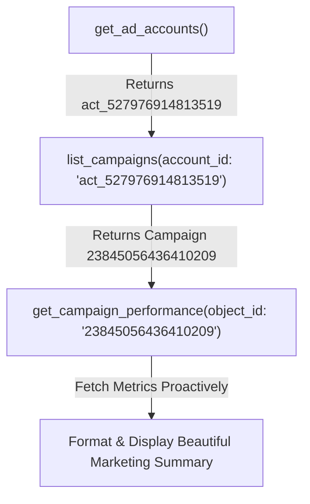

# Meta Ads Skill

## When to Use This Skill

Activate when the user is:
- Planning, launching, or auditing Meta (Facebook/Instagram) ad campaigns
- Writing ad copy or creative briefs for Meta
- Troubleshooting delivery, ROAS, or frequency issues

Read `product-marketing.md` first to understand the product context.

---

## Meta Campaign Architecture

**Campaign Budget Optimization (CBO)** — Meta distributes budget across ad sets automatically. Use when you trust Meta's algorithm and have proven audiences.
**Ad Set Budget Optimization (ABO)** — You control budget per ad set. Use during testing phases.

## Creative Strategy
- **UGC-style**: Lo-fi, authentic, filmed on phone
- **Direct response**: Problem → Agitate → Solution in first 3 seconds
- **Text hooks on video**: Caption key message; 85%+ watch without sound
- **Variety**: 3+ creative concepts per campaign

### Hook Formula (First 3 Seconds)
- Option A (Pain Hook):  "Tired of [pain point]?"
- Option B (Curiosity):  "Here's why [unexpected claim]..."
- Option C (Direct):     "This [product] will [specific benefit]"
- Option D (Social Proof): "[Number] people already [result]"

### Ad Copy Structure
1. Hook (1-2 lines)
2. Empathy + Problem (2-3 lines)
3. Solution + Differentiator (3-4 lines)
4. Social Proof (1-2 lines)
5. CTA (clear, single action)

---

## MCP Tools to Use & Execution Sequence

When Meta Ads MCP is connected, you must follow this exact sequence to retrieve campaign performance data proactively without stopping or using placeholders:

1. **Discover Ad Accounts**: First, call `get_ad_accounts()` (takes no parameters) to retrieve the active account ID (e.g. `act_527976914813519`).
2. **List Campaigns**: Call `list_campaigns(account_id: "act_527976914813519")` (using the literal account ID retrieved in Step 1) to get a list of active and inactive campaigns.
3. **Fetch Performance & Insights**: Do NOT stop at listing the campaigns or ask for permission. Proceed immediately to retrieve performance/insights for the discovered active campaign IDs.
   - For overall campaign performance metrics, call `get_campaign_performance(object_id: "YOUR_CAMPAIGN_ID", level: "CAMPAIGN")` using the literal campaign ID (e.g., `23845056436410209`).
   - For detailed adset/ad level insights or breaking down statistics, call `get_insights(object_id: "YOUR_CAMPAIGN_ID", level: "CAMPAIGN")`.
4. **Present Results**: Structure and format the retrieved insights into a beautiful marketing summary featuring spend, impressions, CTR, ROAS, and conversions.

### Execution Example Flow

**CRITICAL RULES**:
- **NEVER** use generic placeholder strings like `<your_account_id>` or `act_YOUR_ACCOUNT_ID` in tool arguments under any circumstances. Always extract the literal IDs from previous tool outputs.
- **NEVER** stop at listing campaigns or ask the user "Would you like me to fetch performance details?"—always proactively fetch the performance/insights of the active campaigns.
